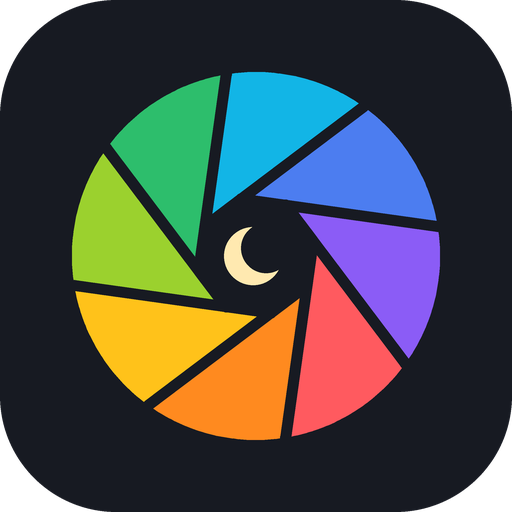

<div align="center">
  

# MomentsOS

**把你每天真实发生的事，整理成可供自己挑选的朋友圈草稿。**

[简体中文](README.md) · [English](README_EN.md)

[](https://www.python.org/)
[](LICENSE)
[](docs/privacy.md)
</div>

---

MomentsOS 是一个**本地优先的开源框架**。它把你主动提供的 Markdown、[言壤](https://github.com/zhaozimin/VoxTerra) 语音日志和 [LifeOS](https://github.com/zhaozimin/LifeOS) 时间记录整理成结构化提示词，再交给你选择的模型生成九条候选。

这个仓库只包含通用框架。它不包含作者的人设、文风样本、朋友圈历史、数据库、私有路径、令牌或线上系统配置。

> [!IMPORTANT]
> MomentsOS 只生成草稿，永不自动发布。事实、隐私与最终表达必须由你本人确认。

## 三分钟开始

需要 Python 3.9 或更高版本。macOS / Linux：

```bash
git clone https://github.com/zhaozimin/MomentsOS.git
cd MomentsOS
./scripts/install.sh
```

查看系统实际使用的全部路径：

```bash
.venv/bin/momentsos paths
```

每天把当天事实写进：

```text
~/.momentsos/context/daily/YYYY-MM-DD.md
```

例如，2026 年 10 月 7 日对应 `~/.momentsos/context/daily/2026-10-07.md`。然后运行：

```bash
.venv/bin/momentsos doctor
.venv/bin/momentsos generate
```

出厂使用 `manual` 模式。命令只生成提示词文件，不会联网。把该文件交给你信任的模型即可。完整步骤见[安装教程](docs/installation.md)。

## 上下文放在哪里

运行数据默认位于 `~/.momentsos/`，不在 Git 仓库里：

| 位置 | 作用 | 更新频率 |
| --- | --- | --- |
| `context/profile.md` | 你的身份、长期项目与公开边界 | 身份变化时 |
| `context/voice.md` | 你亲手写过的公开文字，用于学习语气 | 每月或风格变化时 |
| `context/rules.md` | 不能违反的事实、隐私与写作规则 | 规则变化时 |
| `context/daily/YYYY-MM-DD.md` | 当天发生的事、观察、结果和待确认信息 | **每天生成前** |
| `config/settings.json` | 模型与外部来源配置 | 接入来源或换模型时 |
| `runs/` | 发送给模型前的完整提示词 | 自动生成，敏感 |
| `output/` | 模型返回的候选草稿 | 自动生成，敏感 |

如果你修改了 `MOMENTSOS_HOME` 或 `context.daily_dir`，请以 `momentsos paths` 输出为准。上下文结构、每日模板和外部来源配置见[上下文教程](docs/context.md)。

## 怎样选择模型

先决定一件事：**这些上下文能不能离开你的电脑？**

| 选择 | 适合谁 | 隐私边界 | 配置 |
| --- | --- | --- | --- |
| `manual`，默认 | 想先看清提示词，或使用任意聊天产品 | 程序不联网；你手动粘贴时自行决定发送范围 | 无需配置 |
| 本地 OpenAI 兼容模型 | 上下文敏感，机器能运行本地模型 | 请求只发往 `127.0.0.1` | `provider=openai_compatible`，填写本地地址与模型名 |
| 云端 OpenAI 兼容模型 | 更看重中文写作质量，并接受服务商条款 | 完整提示词会发往服务商 | 另设环境变量密钥，并显式开启 `allow_cloud_context` |

模型至少应具备：稳定中文写作、严格 JSON 输出、较长上下文、低幻觉和良好的指令遵循。不要只按榜单挑模型；用你自己的十条事实做一次盲测，检查它是否虚构、泄露或把计划写成结果。详见[模型选择指南](docs/models.md)。

## 言壤与 LifeOS

MomentsOS 本身不负责记录生活。作者当前使用下面两个本地产品为它提供必要上下文：

- [言壤 · VoiceLog](https://github.com/zhaozimin/VoxTerra)：把本地语音转成 Markdown。MomentsOS 以只读方式读取你在言壤中选择的保存目录。
- [LifeOS](https://github.com/zhaozimin/LifeOS)：记录时间与项目。MomentsOS 以只读方式访问本机 `127.0.0.1` 接口。

两项集成都默认关闭。复制 [`examples/settings.integrations.json`](examples/settings.integrations.json) 中需要的来源到你的 `settings.json`，替换路径，确认无误后再把 `enabled` 改为 `true`。令牌只放环境变量，不写入 JSON。

## 工作流

```text
你的本地事实
  ├─ 每日 Markdown
  ├─ 言壤 Markdown（可选）
  └─ LifeOS 只读接口（可选）
          ↓
    上下文边界与长度限制
          ↓
      可审计提示词
          ↓
  手工 / 本地 / 云端模型
          ↓
   JSON 候选 → 你本人修改与发布
```

## 常用命令

```bash
momentsos init       # 创建缺失模板，不覆盖现有内容
momentsos paths      # 显示上下文与输出的真实路径
momentsos doctor     # 验证配置并列出来源告警
momentsos prompt     # 只构建提示词，绝不调用模型
momentsos generate   # 按 settings.json 调用模型或进入 manual 流程
```

源码安装时，请把 `momentsos` 换成 `.venv/bin/momentsos`。

## 隐私底线

- 仓库与运行数据物理分离；默认运行目录是 `~/.momentsos/`。
- `.gitignore` 排除上下文、提示词、输出、密钥和数据库。
- 外部来源只读。MomentsOS 不会写回言壤或 LifeOS。
- 云端地址默认拒绝。只有 `allow_cloud_context=true` 才允许发送上下文。
- API 密钥只从环境变量读取。
- 发布前运行 `python3 scripts/privacy_check.py`；它不能替代人工检查。

完整边界见[隐私说明](docs/privacy.md)。

## 文档

- [安装教程](docs/installation.md)
- [上下文教程：每天更新哪里、如何接入言壤与 LifeOS](docs/context.md)
- [模型选择指南](docs/models.md)
- [隐私与威胁边界](docs/privacy.md)

## 开发与验证

```bash
python3 -m unittest discover -s tests -v
python3 scripts/privacy_check.py
```

项目当前是可运行的开源骨架，不是作者私有生产系统的镜像。欢迎围绕新的通用连接器、提示词协议和本地界面提交改进；不要提交任何真实上下文或密钥。

## 作者当前使用的上下文产品

- [言壤 · VoiceLog](https://github.com/zhaozimin/VoxTerra)：提供当天真实发生的语音转写上下文。
- [LifeOS](https://github.com/zhaozimin/LifeOS)：提供当天时间、活动与项目上下文。

MomentsOS 负责读取与组织上下文，不替代这两个记录系统。

## License

[MIT](LICENSE) © 2026 zhaozimin
